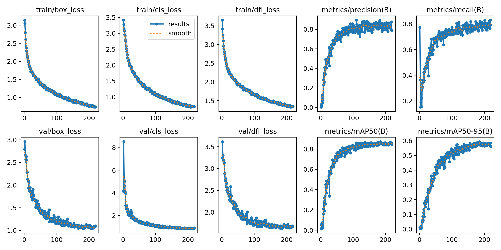
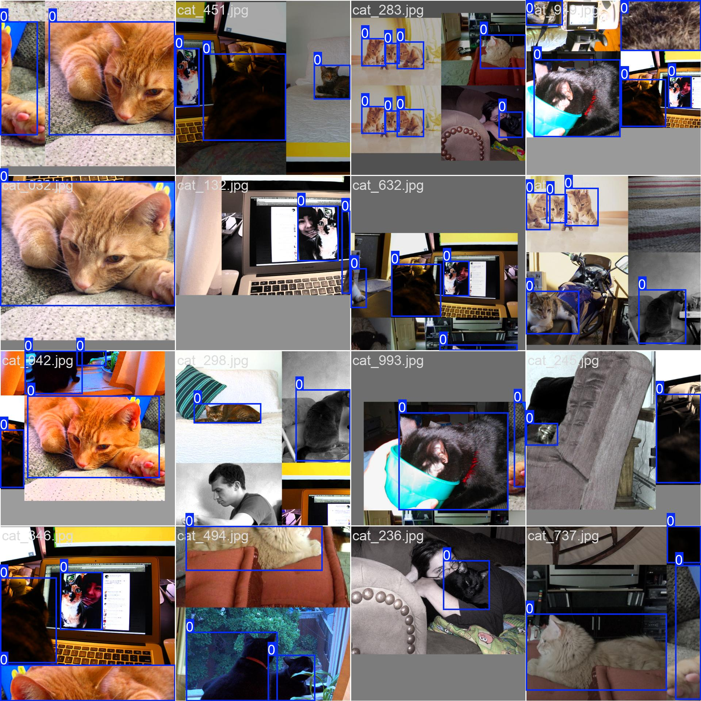

Purpose
=======
The purpose of this project is to train a YOLO model to detect cats, ultimately used to scare off cats that enter human territory

Outline
=======
The project uses a computer vision model [YOLOv8](https://docs.ultralytics.com/models/yolov8/) to search for cats within a specified frame.
The model is based of the pretrained YOLOv8n model by ultralytics, trained on this [dataset](https://www.kaggle.com/datasets/adeneousminz/lab5-dat301m-dataset-praparing). The models functionallity was confirmed on a [imageset](https://github.com/AtharvaTaras/Cat-Images-Dataset) found on GitHub.

Documentation
=============
Being a complete beginner to computer vision, the project initially started with reseaching about computervision. Thereby I focused on lightweight models which can be used to run on a [Raspberry Pi](https://www.raspberrypi.com/) in the parent project. The results heavily encouraged the use of the YOLO series. 

Following online writeups, I initially started training of the YOLOv8n model on the dataset I fetched from kaggle. However the resulting model barely recognised any cats, it seemed like it was guessing almost blindly. No matter how I tweaked the training conditions, the model seemed to not improve at all. In fact the training stopped seeing improvements after a couple Rounds/Epochs of trainig. The best trained model finished early (occurrs when no improvement is seen in the last 100 Epochs) after 232 Epocs, seeing a failiure rate of ~84%, model confidences of between ca. 0.2-0.4 and halft of the detections being false positives.

For me this was a major setback, having no prior experience in machiene learning this looked like a dead end. In a desperate attempt to find the cause, I started manually reviewing the quality of the dataset, even though I had little idea what to look for. Despite that, a inconsistency in the indexing of the labels caught my attention. Since I was training on a single class dataset (cat), labels with indecies other than 0 were outside of the training scope which meant that they were not fed into the training process. This meant that I was training on a dataset of "empty" images with just about every 100th of them containing a cat.

After writing a script to adjust the dataset labeling, I ran a total of 221 Epochs (I was forced to interrupt early). Since peak accurracy was already reacched at 152 Epochs, the early interruption was unproblematic. The resulting model reliably detected cats with confidences most frequently exceeding 88%, however some false positives still remain.

It was at this moment, where I found out about [jones139](https://github.com/jones139)'s [catocam project](https://github.com/jones139/catocam/tree/main), which lead to me orphaning this repo.

Results
=======

TODO
====
- add proper visuals to the documentation
